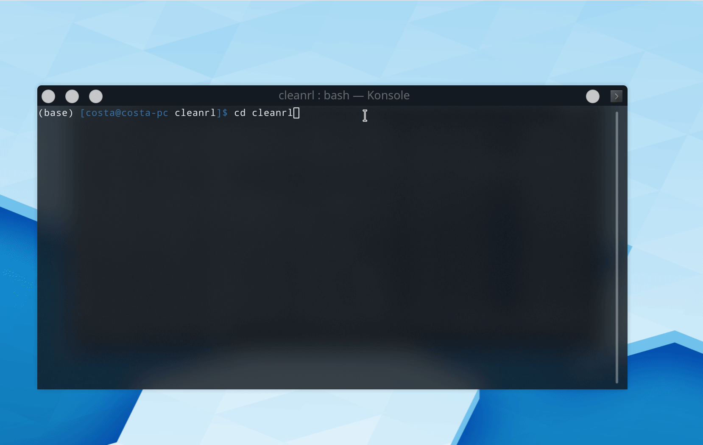

# CleanRL (Clean Implementation of RL Algorithms)

[](https://join.slack.com/t/cleanrl/shared_invite/zt-cj64t5eq-xKZ6sD0KPGFKu1QicHEvVg)
[](https://calendar.google.com/event?action=TEMPLATE&tmeid=bTI1azV1ZGozbDA2Z3I4ajc1dDRkOWlvaTJfMjAyMTAxMTVUMjEwMDAwWiBuZmw0dTBjZnZlbmVicWNiNG1vMjVpaWxqb0Bn&tmsrc=nfl4u0cfvenebqcb4mo25iiljo%40group.calendar.google.com&scp=ALL)
[](https://www.youtube.com/watch?v=dm4HdGujpPs&list=PLQpKd36nzSuMynZLU2soIpNSMeXMplnKP&index=2)


CleanRL is a Deep Reinforcement Learning library that provides high-quality single-file implementation with research-friendly features. The implementation is clean and simple, yet we can scale it to run thousands of experiments at scale using AWS Batch. The highlight features of CleanRL are:

<!-- At the same time, CleanRL tries to supply many research-friendly features such as cloud experiment management, support for continuous and discrete observation and action spaces, video recording of the game play, etc. These features will be very helpful for doing research, especially the video recording feature that *allows you to visually inspect the agents' behavior at various stages of the training*. -->


* 📜 Single-file implementation
   * *Every detail about an algorithm is put into the algorithm's own file.* It is therefore easier to fully understand an algortihm and do research with.
* 📊 Benchmarked Implementation (7+ algorithms and 34+ games at https://benchmark.cleanrl.dev)
* 📈 Tensorboard Logging
* 🪛 Local Reproducibility via Seeding
* 🎮 Videos of Gameplay Capturing
* 🧫 Experiment Management with [Weights and Biases](wandb.com)
* 💸 Cloud Integration with docker and AWS 

Good luck have fun :rocket:

## Algorithms Implemented
- [x] Deep Q-Learning (DQN)
    * [dqn.py](https://github.com/vwxyzjn/cleanrl/blob/master/cleanrl/dqn.py)
        * For discrete action space.
    * [dqn_atari.py](https://github.com/vwxyzjn/cleanrl/blob/master/cleanrl/dqn_atari.py)
        * For playing Atari games. It uses convolutional layers and common atari-based pre-processing techniques.
    * [dqn_atari_visual.py](https://github.com/vwxyzjn/cleanrl/blob/master/cleanrl/dqn_atari_visual.py)
        * Adds q-values visulization for `dqn_atari.py`.
- [x] Categorical DQN (C51)
    * [c51.py](https://github.com/vwxyzjn/cleanrl/blob/master/cleanrl/c51.py)
        * For discrete action space.
    * [c51_atari.py](https://github.com/vwxyzjn/cleanrl/blob/master/cleanrl/c51_atari.py)
        * For playing Atari games. It uses convolutional layers and common atari-based pre-processing techniques.
    * [c51_atari_visual.py](https://github.com/vwxyzjn/cleanrl/blob/master/cleanrl/c51_atari_visual.py)
        * Adds return and q-values visulization for `dqn_atari.py`.
- [x] Proximal Policy Gradient (PPO) 
    * All of the PPO implementations below are augmented with some code-level optimizations. See https://costa.sh/blog-the-32-implementation-details-of-ppo.html for more details
    * [ppo.py](https://github.com/vwxyzjn/cleanrl/blob/master/cleanrl/ppo.py)
        * For discrete action space.
    * [ppo_continuous_action.py](https://github.com/vwxyzjn/cleanrl/blob/master/cleanrl/ppo_continuous_action.py)
        * For continuous action space. Also implemented Mujoco-specific code-level optimizations
    * [ppo_atari.py](https://github.com/vwxyzjn/cleanrl/blob/master/cleanrl/ppo_atari.py)
        * For playing Atari games. It uses convolutional layers and common atari-based pre-processing techniques.
    * [ppo_atari_visual.py](https://github.com/vwxyzjn/cleanrl/blob/master/cleanrl/ppo_atari_visual.py)
        * Adds action probability visulization for `ppo_atari.py`.
    * [experiments/ppo_self_play.py](https://github.com/vwxyzjn/cleanrl/blob/master/cleanrl/experiments/ppo_self_play.py)
        * Implements a self-play agent for https://github.com/hardmaru/slimevolleygym
    * [experiments/ppo_microrts.py](https://github.com/vwxyzjn/cleanrl/blob/master/cleanrl/experiments/ppo_microrts.py)
        * Implements invalid action masking and handling of `MultiDiscrete` action space for https://github.com/vwxyzjn/gym-microrts
    * [experiments/ppo_simple.py](https://github.com/vwxyzjn/cleanrl/blob/master/cleanrl/experiments/ppo_simple.py)
        * (Not recommended for using) Naive implementation for discrete action space. I keep it here for educational purposes because I feel this is what most people would implement if they had just read the paper, usually unaware of the amount of implementation details that come with the well-tuned PPO implmentation.
    * [experiments/ppo_simple_continuous_action.py](https://github.com/vwxyzjn/cleanrl/blob/master/cleanrl/experiments/ppo_simple_continuous_action.py)
        * (Not recommended for using) Naive implementation for continuous action space. 
- [x] Soft Actor Critic (SAC)
    * [sac_continuous_action.py](https://github.com/vwxyzjn/cleanrl/blob/master/cleanrl/sac_continuous_action.py)
        * For continuous action space.
- [x] Deep Deterministic Policy Gradient (DDPG)
    * [ddpg_continuous_action.py](https://github.com/vwxyzjn/cleanrl/blob/master/cleanrl/ddpg_continuous_action.py)
        * For continuous action space.
- [x] Twin Delayed Deep Deterministic Policy Gradient (TD3)
    * [td3_continuous_action.py](https://github.com/vwxyzjn/cleanrl/blob/master/cleanrl/td3_continuous_action.py)
        * For continuous action space.
- [x] Apex Deep Q-Learning (Apex-DQN)
    * [apex_dqn_atari_visual.py](https://github.com/vwxyzjn/cleanrl/blob/master/cleanrl/apex_dqn_atari_visual.py)
        * For playing Atari games. It uses convolutional layers and common atari-based pre-processing techniques.


## Open RL Benchmark

Open RL Benchmark (https://benchmark.cleanrl.dev) is our project to create a comprehensive benchmark of popular DRL algorithms in a variety of games, **where everything about the benchmark is open**. That is, you can check the following information for each experiment:

* hyper-parameters (check it at the [Overview](https://app.wandb.ai/cleanrl/cleanrl.benchmark/runs/2jrqfugg/overview?workspace=user-costa-huang) tab of a run)
* training metrics (e.g. episode reward, training losses. Check it at the [Charts](https://app.wandb.ai/cleanrl/cleanrl.benchmark/runs/2jrqfugg?workspace=user-costa-huang) tab of a run)
* videos of the agents playing the game (check it at the [Charts](https://app.wandb.ai/cleanrl/cleanrl.benchmark/runs/2jrqfugg?workspace=user-costa-huang) tab of a run)
* system metrics (e.g. CPU utilization, memory utilization. Check it at the [Systems](https://app.wandb.ai/cleanrl/cleanrl.benchmark/runs/2jrqfugg/system?workspace=user-costa-huang) tab of a run)
* `stdout, stderr` of the script (check it at the [Logs](
https://app.wandb.ai/cleanrl/cleanrl.benchmark/runs/2jrqfugg/logs?workspace=user-costa-huang) tab of a run)
* all dependencies (check `requirements.txt` at the [Files](
https://app.wandb.ai/cleanrl/cleanrl.benchmark/runs/2jrqfugg/files/requirements.txt) tab of a run))
* source code (this is especially helpful since we have *single file implementation*, so we know exactly all of the code that is responsible for the run. Check it at the [Code](
https://app.wandb.ai/cleanrl/cleanrl.benchmark/runs/2jrqfugg/code?workspace=user-costa-huang) tab of a run))
* (Currently not working. Public access is blocked by https://github.com/wandb/client/issues/1177) the exact commands to reproduce it (check it at the [Overview](https://app.wandb.ai/cleanrl/cleanrl.benchmark/runs/2jrqfugg/overview?workspace=user-costa-huang) tab of a run.

We hope it could bring a new level of transparency, openness, and reproducibility. Our plan is to 
benchmark as many algorithms and games as possible. If you are interested, please join us and contribute
more algorithms and games. To get started, check out our [contribution guide](https://github.com/vwxyzjn/cleanrl/blob/master/CONTRIBUTING.md) and our [roadmap for the Open RL Benchmark](https://github.com/vwxyzjn/cleanrl/projects/1)

We currently support  34+ games and our implmentation performs competitively against published results. See the table below for selected examples

|                       | c51_atari_visual.py   | dqn_atari_visual.py   | ppo_atari_visual.py   |
|:----------------------------|:-------------------|:-------------------|:-------------------|
| BeamRiderNoFrameskip-v4     | 9128.00 ± 0.00     | 6156.13 ± 461.47   | 1881.11 ± 166.89   |
| QbertNoFrameskip-v4         | 13814.24 ± 3357.99 | 15241.67 ± 0.00    | 18755.36 ± 205.36  |
| SpaceInvadersNoFrameskip-v4 | 2140.00 ± 0.00     | 1616.11 ± 226.67   | 871.56 ± 133.44    |
| PongNoFrameskip-v4          | 16.33 ± 0.00       | 19.33 ± 0.33       | 20.89 ± 0.00       |
| BreakoutNoFrameskip-v4      | 404.11 ± 0.00      | 354.78 ± 9.22      | 413.73 ± 15.39     |

|                    | ddpg_continuous_action.py   | td3_continuous_action.py   | ppo_continuous_action.py   |
|:-------------------------|:-------------------------|:------------------------|:------------------------|
| Ant-v2                   | 503.32 ± 18.70           | 5368.18 ± 771.11        | 3368.17 ± 759.13        |
| Humanoid-v2              | 942.16 ± 436.22          | 6334.40 ± 140.05        | 918.19 ± 102.71         |
| Walker2DBulletEnv-v0     | 708.51 ± 240.64          | 2168.87 ± 65.78         | 906.10 ± 51.96          |
| HalfCheetahBulletEnv-v0  | 2821.87 ± 266.03         | 2542.99 ± 318.23        | 2189.66 ± 141.61        |
| HopperBulletEnv-v0       | 1540.77 ± 821.54         | 2302.09 ± 24.46         | 2300.96 ± 47.46         |
| BipedalWalker-v3         | 140.20 ± 52.05           | 164.06 ± 147.22         | 219.96 ± 47.49          |
| LunarLanderContinuous-v2 | 210.01 ± 0.00            | 290.73 ± 4.44           | 161.28 ± 37.48          |
| Pendulum-v0              | -186.83 ± 12.35          | -246.53 ± 6.73          | -1280.11 ± 39.22        |
| MountainCarContinuous-v0 | -0.98 ± 0.02             | -1.11 ± 0.10            | 93.84 ± 0.00            |


## Get started

To run experiments locally, give the following a try:

```bash
$ git clone https://github.com/vwxyzjn/cleanrl.git && cd cleanrl
$ pip install -e .
$ cd cleanrl
$ python ppo.py \
    --seed 1 \
    --gym-id CartPole-v0 \
    --total-timesteps 50000 \
# open another temrminal and enter `cd cleanrl/cleanrl`
$ tensorboard --logdir runs
```


To use wandb integration, sign up an account at https://wandb.com and copy the API key.
Then run

```bash
$ cd cleanrl
$ pip install wandb
$ wandb login ${WANBD_API_KEY}
$ python ppo.py \
    --seed 1 \
    --gym-id CartPole-v0 \
    --total-timesteps 50000 \
    --prod-mode \
    --wandb-project-name cleanrltest 
# Then go to https://app.wandb.ai/${WANDB_USERNAME}/cleanrltest/
```

Checkout the demo sites at [https://app.wandb.ai/costa-huang/cleanrltest](https://app.wandb.ai/costa-huang/cleanrltest)




# Install optional dependencies

The following instructions assume linux environements

```bash
# installing starcraft
# enter pass word `iagreetotheeula` when prompted
$ rm ~/StarCraftII -fR \
wget -O ~/StarCraftII.zip http://blzdistsc2-a.akamaihd.net/Linux/SC2.4.10.zip && \
unzip ~/StarCraftII.zip -d ~/ && \
rm ~/StarCraftII.zip
mv ~/StarCraftII/Libs/libstdc++.so.6 ~/StarCraftII/libstdc++.so.6


# install microrts
$ pip install gym-microrts
```

## Support and get involved

We have a [Slack Community](https://join.slack.com/t/cleanrl/shared_invite/zt-cj64t5eq-xKZ6sD0KPGFKu1QicHEvVg) for support. Feel free to ask questions. Posting in [Github Issues](https://github.com/vwxyzjn/cleanrl/issues) and PRs are also welcome. 

In addition, we also have a monthly development cycle to implement new RL algorithms. Feel free to participate or ask questions there, too. You can sign up for our mailing list at our [Google Groups](https://groups.google.com/forum/#!forum/rlimplementation/join) to receive event RVSP which contains the Hangout video call address every week. Our past video recordings are available at [YouTube](https://www.youtube.com/watch?v=dm4HdGujpPs&list=PLQpKd36nzSuMynZLU2soIpNSMeXMplnKP&index=2)

## Contribution

We have a short contribution guide here https://github.com/vwxyzjn/cleanrl/blob/master/CONTRIBUTING.md. Consider adding new algorithms 
or test new games on the Open RL Benchmark (https://benchmark.cleanrl.dev)

Big thanks to all the contributors of CleanRL!


## Citing our project

Please consider using the following Bibtex entry:

```
@misc{cleanrl,
  author = {Shengyi Huang, Rousslan Dossa, and Chang Ye},
  title = {CleanRL: High-quality Single-file Implementation of Deep Reinforcement Learning algorithms},
  year = {2020},
  publisher = {GitHub},
  journal = {GitHub repository},
  howpublished = {\url{https://github.com/vwxyzjn/cleanrl/}},
}
```


## References

I have been heavily inspired by the many repos and blog posts. Below contains a incomplete list of them.

* http://inoryy.com/post/tensorflow2-deep-reinforcement-learning/
* https://github.com/seungeunrho/minimalRL
* https://github.com/Shmuma/Deep-Reinforcement-Learning-Hands-On
* https://github.com/hill-a/stable-baselines

The following ones helped me a lot with the continuous action space handling:

* https://github.com/ikostrikov/pytorch-a2c-ppo-acktr-gail
* https://github.com/zhangchuheng123/Reinforcement-Implementation/blob/master/code/ppo.py
