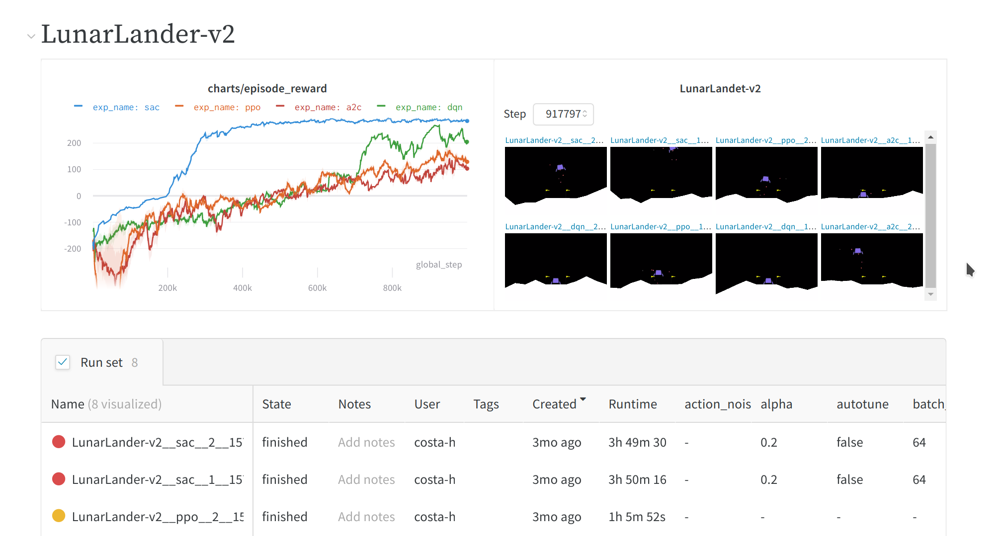

# CleanRL 

This repository focuses on a clean and minimal implementation of reinforcement learning algorithms. The highlights features of this repo is:

* Most algorithms are self-contained in single files with a common dependency file [common.py](https://github.com/vwxyzjn/cleanrl/blob/master/cleanrl/common.py) that handles different gym spaces.

* Easy logging of training processes using Tensorboard and Integration with wandb.com to log experiments on the cloud. Check out https://app.wandb.ai/costa-huang/cleanrltest.

* Being able to debug *directly* in Python’s interactive shell.

* Convenient use of commandline arguments for hyper-parameters tuning.



## Get started

To run experiments locally, give the following a try:

```bash
$ git clone https://github.com/vwxyzjn/cleanrl.git && cd cleanrl
$ pip install -e .
$ cd cleanrl
$ python a2c.py \
    --seed 1 \
    --gym-id CartPole-v0 \
    --total-timesteps 50000 \
# open another temrminal and enter `cd cleanrl/cleanrl`
$ tensorboard --logdir runs
```


To use wandb integration, signup at https://wandb.com and copy the API key.
Then run

```bash
$ cd cleanrl
$ pip install wandb
$ wandb login ${WANBD_API_KEY}
$ python a2c.py \
    --seed 1 \
    --gym-id CartPole-v0 \
    --total-timesteps 50000 \
    --prod-mode True \
    --wandb-project-name cleanrltest 
# Then go to https://app.wandb.ai/${WANDB_USERNAME}/cleanrltest/
```

Checkout the demo sites at [https://app.wandb.ai/costa-huang/cleanrltest](https://app.wandb.ai/costa-huang/cleanrltest)


