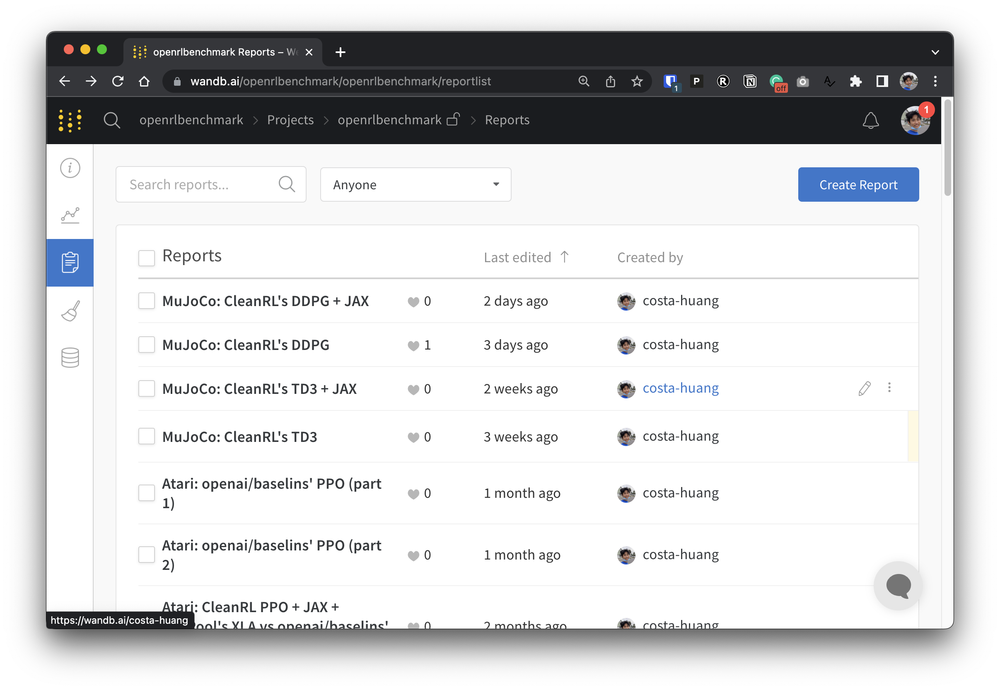

# CleanRL (Clean Implementation of RL Algorithms)


[](https://github.com/vwxyzjn/cleanrl)
[](https://github.com/vwxyzjn/cleanrl/actions/workflows/tests.yaml)
[](https://docs.cleanrl.dev/)
[](https://discord.gg/D6RCjA6sVT)
[](https://www.youtube.com/channel/UCDdC6BIFRI0jvcwuhi3aI6w/videos)
[](https://github.com/psf/black)
[](https://pycqa.github.io/isort/)
[](https://huggingface.co/cleanrl)
[](https://colab.research.google.com/github/vwxyzjn/cleanrl/blob/master/docs/get-started/CleanRL_Huggingface_Integration_Demo.ipynb)


CleanRL is a Deep Reinforcement Learning library that provides high-quality single-file implementation with research-friendly features. The implementation is clean and simple, yet we can scale it to run thousands of experiments using AWS Batch. The highlight features of CleanRL are:


* 📜 Single-file implementation
   * *Every detail about an algorithm variant is put into a single standalone file.* 
   * For example, our `ppo_atari.py` only has 340 lines of code but contains all implementation details on how PPO works with Atari games, **so it is a great reference implementation to read for folks who do not wish to read an entire modular library**.
* 📊 Benchmarked Implementation (7+ algorithms and 34+ games at https://benchmark.cleanrl.dev)
* 📈 Tensorboard Logging
* 🪛 Local Reproducibility via Seeding
* 🎮 Videos of Gameplay Capturing
* 🧫 Experiment Management with [Weights and Biases](https://wandb.ai/site)
* 💸 Cloud Integration with docker and AWS 

You can read more about CleanRL in our [JMLR paper](https://www.jmlr.org/papers/volume23/21-1342/21-1342.pdf) and [documentation](https://docs.cleanrl.dev/).

Notable CleanRL-related projects:

* [corl-team/CORL](https://github.com/corl-team/CORL): Offline RL algorithm implemented in CleanRL style
* [pytorch-labs/LeanRL](https://github.com/pytorch-labs/LeanRL): Fast optimized PyTorch implementation of CleanRL RL algorithms using CUDAGraphs.


> ℹ️ **Support for Gymnasium**: [Farama-Foundation/Gymnasium](https://github.com/Farama-Foundation/Gymnasium) is the next generation of [`openai/gym`](https://github.com/openai/gym) that will continue to be maintained and introduce new features. Please see their [announcement](https://farama.org/Announcing-The-Farama-Foundation) for further detail. We are migrating to `gymnasium` and the progress can be tracked in [vwxyzjn/cleanrl#277](https://github.com/vwxyzjn/cleanrl/pull/277). 


> ⚠️ **NOTE**: CleanRL is *not* a modular library and therefore it is not meant to be imported. At the cost of duplicate code, we make all implementation details of a DRL algorithm variant easy to understand, so CleanRL comes with its own pros and cons. You should consider using CleanRL if you want to 1) understand all implementation details of an algorithm's varaint or 2) prototype advanced features that other modular DRL libraries do not support (CleanRL has minimal lines of code so it gives you great debugging experience and you don't have do a lot of subclassing like sometimes in modular DRL libraries).

## Get started

Prerequisites:
* Python >=3.7.1,<3.11
* [Poetry 1.2.1+](https://python-poetry.org)

To run experiments locally, give the following a try:

```bash
git clone https://github.com/vwxyzjn/cleanrl.git && cd cleanrl
poetry install

# alternatively, you could use `poetry shell` and do
# `python run cleanrl/ppo.py`
poetry run python cleanrl/ppo.py \
    --seed 1 \
    --env-id CartPole-v0 \
    --total-timesteps 50000

# open another terminal and enter `cd cleanrl/cleanrl`
tensorboard --logdir runs
```

To use experiment tracking with wandb, run
```bash
wandb login # only required for the first time
poetry run python cleanrl/ppo.py \
    --seed 1 \
    --env-id CartPole-v0 \
    --total-timesteps 50000 \
    --track \
    --wandb-project-name cleanrltest
```

If you are not using `poetry`, you can install CleanRL with `requirements.txt`:

```bash
# core dependencies
pip install -r requirements/requirements.txt

# optional dependencies
pip install -r requirements/requirements-atari.txt
pip install -r requirements/requirements-mujoco.txt
pip install -r requirements/requirements-mujoco_py.txt
pip install -r requirements/requirements-procgen.txt
pip install -r requirements/requirements-envpool.txt
pip install -r requirements/requirements-pettingzoo.txt
pip install -r requirements/requirements-jax.txt
pip install -r requirements/requirements-docs.txt
pip install -r requirements/requirements-cloud.txt
pip install -r requirements/requirements-memory_gym.txt
```

To run training scripts in other games:
```
poetry shell

# classic control
python cleanrl/dqn.py --env-id CartPole-v1
python cleanrl/ppo.py --env-id CartPole-v1
python cleanrl/c51.py --env-id CartPole-v1

# atari
poetry install -E atari
python cleanrl/dqn_atari.py --env-id BreakoutNoFrameskip-v4
python cleanrl/c51_atari.py --env-id BreakoutNoFrameskip-v4
python cleanrl/ppo_atari.py --env-id BreakoutNoFrameskip-v4
python cleanrl/sac_atari.py --env-id BreakoutNoFrameskip-v4

# NEW: 3-4x side-effects free speed up with envpool's atari (only available to linux)
poetry install -E envpool
python cleanrl/ppo_atari_envpool.py --env-id BreakoutNoFrameskip-v4
# Learn Pong-v5 in ~5-10 mins
# Side effects such as lower sample efficiency might occur
poetry run python ppo_atari_envpool.py --clip-coef=0.2 --num-envs=16 --num-minibatches=8 --num-steps=128 --update-epochs=3

# procgen
poetry install -E procgen
python cleanrl/ppo_procgen.py --env-id starpilot
python cleanrl/ppg_procgen.py --env-id starpilot

# ppo + lstm
poetry install -E atari
python cleanrl/ppo_atari_lstm.py --env-id BreakoutNoFrameskip-v4
```

You may also use a prebuilt development environment hosted in Gitpod:

[](https://gitpod.io/#https://github.com/vwxyzjn/cleanrl)

## Algorithms Implemented


| Algorithm      | Variants Implemented |
| ----------- | ----------- |
| ✅ [Proximal Policy Gradient (PPO)](https://arxiv.org/pdf/1707.06347.pdf)  |  [`ppo.py`](https://github.com/vwxyzjn/cleanrl/blob/master/cleanrl/ppo.py),   [docs](https://docs.cleanrl.dev/rl-algorithms/ppo/#ppopy) |
| |  [`ppo_atari.py`](https://github.com/vwxyzjn/cleanrl/blob/master/cleanrl/ppo_atari.py),   [docs](https://docs.cleanrl.dev/rl-algorithms/ppo/#ppo_ataripy)
| |  [`ppo_continuous_action.py`](https://github.com/vwxyzjn/cleanrl/blob/master/cleanrl/ppo_continuous_action.py),   [docs](https://docs.cleanrl.dev/rl-algorithms/ppo/#ppo_continuous_actionpy)
| |  [`ppo_atari_lstm.py`](https://github.com/vwxyzjn/cleanrl/blob/master/cleanrl/ppo_atari_lstm.py),   [docs](https://docs.cleanrl.dev/rl-algorithms/ppo/#ppo_atari_lstmpy)
| |  [`ppo_atari_envpool.py`](https://github.com/vwxyzjn/cleanrl/blob/master/cleanrl/ppo_atari_envpool.py),   [docs](https://docs.cleanrl.dev/rl-algorithms/ppo/#ppo_atari_envpoolpy)
| | [`ppo_atari_envpool_xla_jax.py`](https://github.com/vwxyzjn/cleanrl/blob/master/cleanrl/ppo_atari_envpool_xla_jax.py), [docs](https://docs.cleanrl.dev/rl-algorithms/ppo/#ppo_atari_envpool_xla_jaxpy)
| | [`ppo_atari_envpool_xla_jax_scan.py`](https://github.com/vwxyzjn/cleanrl/blob/master/cleanrl/ppo_atari_envpool_xla_jax_scan.py), [docs](https://docs.cleanrl.dev/rl-algorithms/ppo/#ppo_atari_envpool_xla_jax_scanpy))
| |  [`ppo_procgen.py`](https://github.com/vwxyzjn/cleanrl/blob/master/cleanrl/ppo_procgen.py),   [docs](https://docs.cleanrl.dev/rl-algorithms/ppo/#ppo_procgenpy)
| |  [`ppo_atari_multigpu.py`](https://github.com/vwxyzjn/cleanrl/blob/master/cleanrl/ppo_atari_multigpu.py),  [docs](https://docs.cleanrl.dev/rl-algorithms/ppo/#ppo_atari_multigpupy)
| | [`ppo_pettingzoo_ma_atari.py`](https://github.com/vwxyzjn/cleanrl/blob/master/cleanrl/ppo_pettingzoo_ma_atari.py),  [docs](https://docs.cleanrl.dev/rl-algorithms/ppo/#ppo_pettingzoo_ma_ataripy)
| | [`ppo_continuous_action_isaacgym.py`](https://github.com/vwxyzjn/cleanrl/blob/master/cleanrl/ppo_continuous_action_isaacgym/ppo_continuous_action_isaacgym.py),  [docs](https://docs.cleanrl.dev/rl-algorithms/ppo/#ppo_continuous_action_isaacgympy)
| | [`ppo_trxl.py`](https://github.com/vwxyzjn/cleanrl/blob/master/cleanrl/ppo_trxl/ppo_trxl.py),  [docs](https://docs.cleanrl.dev/rl-algorithms/ppo-trxl/)
| ✅ [Deep Q-Learning (DQN)](https://web.stanford.edu/class/psych209/Readings/MnihEtAlHassibis15NatureControlDeepRL.pdf) |  [`dqn.py`](https://github.com/vwxyzjn/cleanrl/blob/master/cleanrl/dqn.py),  [docs](https://docs.cleanrl.dev/rl-algorithms/dqn/#dqnpy) |
| | [`dqn_atari.py`](https://github.com/vwxyzjn/cleanrl/blob/master/cleanrl/dqn_atari.py),  [docs](https://docs.cleanrl.dev/rl-algorithms/dqn/#dqn_ataripy) |
| | [`dqn_jax.py`](https://github.com/vwxyzjn/cleanrl/blob/master/cleanrl/dqn_jax.py), [docs](https://docs.cleanrl.dev/rl-algorithms/dqn/#dqn_jaxpy) |
| | [`dqn_atari_jax.py`](https://github.com/vwxyzjn/cleanrl/blob/master/cleanrl/dqn_atari_jax.py), [docs](https://docs.cleanrl.dev/rl-algorithms/dqn/#dqn_atari_jaxpy) |
| ✅ [Categorical DQN (C51)](https://arxiv.org/pdf/1707.06887.pdf) |  [`c51.py`](https://github.com/vwxyzjn/cleanrl/blob/master/cleanrl/c51.py),  [docs](https://docs.cleanrl.dev/rl-algorithms/c51/#c51py) |
| |  [`c51_atari.py`](https://github.com/vwxyzjn/cleanrl/blob/master/cleanrl/c51_atari.py),  [docs](https://docs.cleanrl.dev/rl-algorithms/c51/#c51_ataripy) |
| | [`c51_jax.py`](https://github.com/vwxyzjn/cleanrl/blob/master/cleanrl/c51_jax.py), [docs](https://docs.cleanrl.dev/rl-algorithms/c51/#c51_jaxpy) |
| | [`c51_atari_jax.py`](https://github.com/vwxyzjn/cleanrl/blob/master/cleanrl/c51_atari_jax.py), [docs](https://docs.cleanrl.dev/rl-algorithms/c51/#c51_atari_jaxpy) |
| ✅ [Soft Actor-Critic (SAC)](https://arxiv.org/pdf/1812.05905.pdf) |  [`sac_continuous_action.py`](https://github.com/vwxyzjn/cleanrl/blob/master/cleanrl/sac_continuous_action.py),  [docs](https://docs.cleanrl.dev/rl-algorithms/sac/#sac_continuous_actionpy) |
| |  [`sac_atari.py`](https://github.com/vwxyzjn/cleanrl/blob/master/cleanrl/sac_atari.py),  [docs](https://docs.cleanrl.dev/rl-algorithms/sac/#sac_atarinpy) |
| ✅ [Deep Deterministic Policy Gradient (DDPG)](https://arxiv.org/pdf/1509.02971.pdf) |  [`ddpg_continuous_action.py`](https://github.com/vwxyzjn/cleanrl/blob/master/cleanrl/ddpg_continuous_action.py),  [docs](https://docs.cleanrl.dev/rl-algorithms/ddpg/#ddpg_continuous_actionpy) |
| | [`ddpg_continuous_action_jax.py`](https://github.com/vwxyzjn/cleanrl/blob/master/cleanrl/ddpg_continuous_action_jax.py),  [docs](https://docs.cleanrl.dev/rl-algorithms/ddpg/#ddpg_continuous_action_jaxpy)
| ✅ [Twin Delayed Deep Deterministic Policy Gradient (TD3)](https://arxiv.org/pdf/1802.09477.pdf) |  [`td3_continuous_action.py`](https://github.com/vwxyzjn/cleanrl/blob/master/cleanrl/td3_continuous_action.py),  [docs](https://docs.cleanrl.dev/rl-algorithms/td3/#td3_continuous_actionpy) |
|  | [`td3_continuous_action_jax.py`](https://github.com/vwxyzjn/cleanrl/blob/master/cleanrl/td3_continuous_action_jax.py),  [docs](https://docs.cleanrl.dev/rl-algorithms/td3/#td3_continuous_action_jaxpy) |
| ✅ [Phasic Policy Gradient (PPG)](https://arxiv.org/abs/2009.04416) |  [`ppg_procgen.py`](https://github.com/vwxyzjn/cleanrl/blob/master/cleanrl/ppg_procgen.py),  [docs](https://docs.cleanrl.dev/rl-algorithms/ppg/#ppg_procgenpy) |
| ✅ [Random Network Distillation (RND)](https://arxiv.org/abs/1810.12894) |  [`ppo_rnd_envpool.py`](https://github.com/vwxyzjn/cleanrl/blob/master/cleanrl/ppo_rnd_envpool.py),  [docs](/rl-algorithms/ppo-rnd/#ppo_rnd_envpoolpy) |
| ✅ [Qdagger](https://arxiv.org/abs/2206.01626)  |  [`qdagger_dqn_atari_impalacnn.py`](https://github.com/vwxyzjn/cleanrl/blob/master/cleanrl/qdagger_dqn_atari_impalacnn.py),  [docs](https://docs.cleanrl.dev/rl-algorithms/qdagger/#qdagger_dqn_atari_impalacnnpy) |
|  | [`qdagger_dqn_atari_jax_impalacnn.py`](https://github.com/vwxyzjn/cleanrl/blob/master/cleanrl/qdagger_dqn_atari_jax_impalacnn.py), [docs](https://docs.cleanrl.dev/rl-algorithms/qdagger/#qdagger_dqn_atari_jax_impalacnnpy) |


## Open RL Benchmark

To make our experimental data transparent, CleanRL participates in a related project called [Open RL Benchmark](https://github.com/openrlbenchmark/openrlbenchmark), which contains tracked experiments from popular DRL libraries such as ours, [Stable-baselines3](https://github.com/DLR-RM/stable-baselines3), [openai/baselines](https://github.com/openai/baselines), [jaxrl](https://github.com/ikostrikov/jaxrl), and others. 

Check out https://benchmark.cleanrl.dev/ for a collection of Weights and Biases reports showcasing tracked DRL experiments. The reports are interactive, and researchers can easily query information such as GPU utilization and videos of an agent's gameplay that are normally hard to acquire in other RL benchmarks. In the future, Open RL Benchmark will likely provide an dataset API for researchers to easily access the data (see [repo](https://github.com/openrlbenchmark/openrlbenchmark)).




## Support and get involved

We have a [Discord Community](https://discord.gg/D6RCjA6sVT) for support. Feel free to ask questions. Posting in [Github Issues](https://github.com/vwxyzjn/cleanrl/issues) and PRs are also welcome. Also our past video recordings are available at [YouTube](https://www.youtube.com/watch?v=dm4HdGujpPs&list=PLQpKd36nzSuMynZLU2soIpNSMeXMplnKP&index=2)

## Citing CleanRL

If you use CleanRL in your work, please cite our technical [paper](https://www.jmlr.org/papers/v23/21-1342.html):

```bibtex
@article{huang2022cleanrl,
  author  = {Shengyi Huang and Rousslan Fernand Julien Dossa and Chang Ye and Jeff Braga and Dipam Chakraborty and Kinal Mehta and João G.M. Araújo},
  title   = {CleanRL: High-quality Single-file Implementations of Deep Reinforcement Learning Algorithms},
  journal = {Journal of Machine Learning Research},
  year    = {2022},
  volume  = {23},
  number  = {274},
  pages   = {1--18},
  url     = {http://jmlr.org/papers/v23/21-1342.html}
}
```


## Acknowledgement

CleanRL is a community-powered by project and our contributors run experiments on a variety of hardware.

* We thank many contributors for using their own computers to run experiments
* We thank Google's [TPU research cloud](https://sites.research.google/trc/about/) for providing TPU resources.
* We thank [Hugging Face](https://huggingface.co/)'s cluster for providing GPU resources. 
