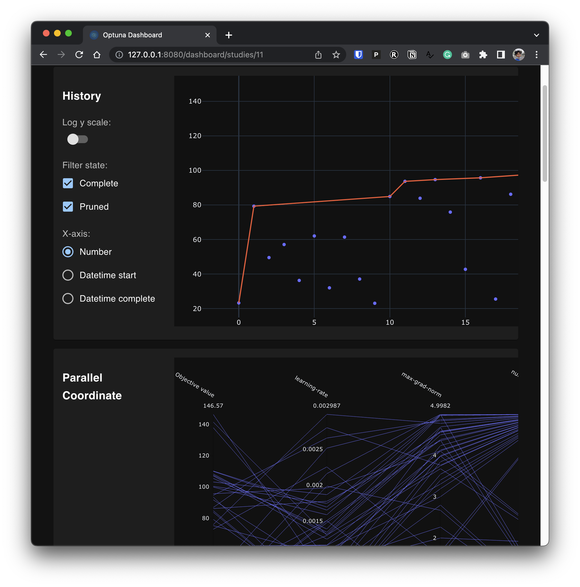

# Hyperparameter Tuning

CleanRL comes with a simple and practical hyperparameter tuning utility `Tuner`.

## Get started

Create the following file:

```python title="tuner_example.py"
from cleanrl_utils.tuner import Tuner
tuner = Tuner(
    script="cleanrl/ppo.py",
    metric="charts/episodic_return",
    metric_last_n_average_window=50,
    direction="maximize",
    aggregation_type="average",
    target_scores={
        "CartPole-v1": None,
    },
    params_fn=lambda trial: {
        "learning-rate": trial.suggest_loguniform("learning-rate", 0.0003, 0.003),
        "num-minibatches": trial.suggest_categorical("num-minibatches", [1, 2, 4]),
        "update-epochs": trial.suggest_categorical("update-epochs", [1, 2, 4]),
        "num-steps": trial.suggest_categorical("num-steps", [5, 16, 32, 64, 128]),
        "vf-coef": trial.suggest_uniform("vf-coef", 0, 5),
        "max-grad-norm": trial.suggest_uniform("max-grad-norm", 0, 5),
        "total-timesteps": 10000,
        "num-envs": 4,
    },
)
tuner.tune(
    num_trials=100,
    num_seeds=3,
)
```

Then you can run the tuner with 

```bash
poetry install -E optuna
python tuner_example.py
```

Here is what happened:

1. The `tuner_example.py` launches `num_trials=100` *trials* to find the best single set of hyperparameters for `CartPole-v1` in `script="cleanrl/ppo.py"`.
1. Each *trial* samples a set of hyperparameters from the `params_fn` to run `num_seeds=3` *experiments* with different random seeds, mitigating the impact of randomness on the results. 
    * In each *experiment*, `tuner_example.py` averages the last `metric_last_n_average_window=50` reported `metric="charts/episodic_return"` to a number $x_i$ and calculate a normalized score $z_i$ according to the `target_scores`. We will talk more about `target_scores` which is useful when working with multiple environments in the next section, but in this section we just set `None` as the target score for `CartPole-v1` — this means we will set the normalized score $z_i = x_i$.
1. Each *trial* then averages the normalized scores $z_i$ of the `num_seeds=3` *experiments* to a number $z$ and the tuner optimizes $z$ according `direction="maximize"`.


## Visualization

Running `python tuner_example.py` will create a sqlite database containing all of the hyperparameter trials in `./cleanrl_hpopt.db`. We can use [optuna-dashboard](https://github.com/optuna/optuna-dashboard) to visualize the process.

```bash
poetry run optuna-dashboard sqlite:///cleanrl_hpopt.db
```

You can use a different database by passing `Tuner(..., storage="mysql://root@localhost/example")` to use a more persistent storage.



## Work w/ multiple environments

Often it is useful to find a single set of hyper parameters that work well with multiple environments, but this is challenging **because each environment may have different reward scales**, so we need to do normalization. 

This is where `target_scores` comes in. We can use it to specify an upper and lower threshold of rewards for each environment (they don't have to be exact boundaries and can be just ballpark estimates). For example, if we want to find a set of hyper parameters that work well with `CartPole-v1` and `Acrobot-v1`, we can set the `target_scores` and `aggregation_type` as follows:


```python title="tuner_example_multi_env.py" hl_lines="7-11"
from cleanrl_utils.tuner import Tuner
tuner = Tuner(
    script="cleanrl/ppo.py",
    metric="charts/episodic_return",
    metric_last_n_average_window=50,
    direction="maximize",
    aggregation_type="average",
    target_scores={
        "CartPole-v1": [0, 500],
        "Acrobot-v1": [-500, 0],
    },
    params_fn=lambda trial: {
        "learning-rate": trial.suggest_loguniform("learning-rate", 0.0003, 0.003),
        "num-minibatches": trial.suggest_categorical("num-minibatches", [1, 2, 4]),
        "update-epochs": trial.suggest_categorical("update-epochs", [1, 2, 4]),
        "num-steps": trial.suggest_categorical("num-steps", [5, 16, 32, 64, 128]),
        "vf-coef": trial.suggest_uniform("vf-coef", 0, 5),
        "max-grad-norm": trial.suggest_uniform("max-grad-norm", 0, 5),
        "total-timesteps": 10000,
        "num-envs": 16,
    },
)
tuner.tune(
    num_trials=100,
    num_seeds=3,
)
```

Then each experiment will calculate the normalized scores $z_{i_0} = (x_{i_0} - 0) / (500 - 0), z_{i_1} = (x_{i_1} - -500) / (0 - -500)$ and the tuner will `aggregation_type="average"` the two scores to get the normalized score $z_i = (z_{i_0} + z_{i_1}) / 2$.

Note that we are using 3 random seeds for each environment in `["CartPole-v1","Acrobot-v1"]`, totalling `2*3=6` experiments per trial.


???+ info

    When optimizing Atari games, you can put the human normalized scores in `target_scores` (Mnih et al., 2015, Extended Data Table 2)[^1], as done in the following example. The first number for each environment is the score obtained by random play and the second number is the score obtained by professional game testers.

    ```python
    tuner = Tuner(
        script="cleanrl/ppo_atari.py",
        metric="charts/episodic_return",
        metric_last_n_average_window=50,
        direction="maximize",
        aggregation_type="average",
        target_scores={
            "Alien-v5": [227.8, 6875],
            "Amidar-v5": [5.8, 1676],
            'Assault-v5': (222.4, 1496),
            'Asterix-v5': (210.0, 8503),
            'Asteroids-v5': (719.1, 13157),
            ...
        },
        ...
    )
    ```


## Work w/ pruners and samplers

You can use `Tuner` with any [pruner](https://optuna.readthedocs.io/en/stable/reference/pruners.html) from `optuna` to prune less promising experiments or [samplers](https://optuna.readthedocs.io/en/stable/reference/samplers.html) to sample new hyperparameters. If you don't specify them explicitly, the script will use the [default ones](https://optuna.readthedocs.io/en/stable/reference/generated/optuna.create_study.html).

```python title="tuner_example_pruner.py" hl_lines="1 23 24"
import optuna
from cleanrl_utils.tuner import Tuner
tuner = Tuner(
    script="cleanrl/ppo.py",
    metric="charts/episodic_return",
    metric_last_n_average_window=50,
    direction="maximize",
    aggregation_type="average",
    target_scores={
        "CartPole-v1": [0, 500],
        "Acrobot-v1": [-500, 0],
    },
    params_fn=lambda trial: {
        "learning-rate": trial.suggest_loguniform("learning-rate", 0.0003, 0.003),
        "num-minibatches": trial.suggest_categorical("num-minibatches", [1, 2, 4]),
        "update-epochs": trial.suggest_categorical("update-epochs", [1, 2, 4]),
        "num-steps": trial.suggest_categorical("num-steps", [5, 16, 32, 64, 128]),
        "vf-coef": trial.suggest_uniform("vf-coef", 0, 5),
        "max-grad-norm": trial.suggest_uniform("max-grad-norm", 0, 5),
        "total-timesteps": 10000,
        "num-envs": 16,
    },
    pruner=optuna.pruners.MedianPruner(n_startup_trials=5),
    sampler=optuna.samplers.TPESampler(),
)
tuner.tune(
    num_trials=100,
    num_seeds=3,
)
```


## Track experiments w/ Weights and Biases

The `Tuner` can track all the experiments into [Weights and Biases](https://wandb.ai) to help you visualize the progress of the tuning.


```python title="tuner_example.py" hl_lines="25"
import optuna
from cleanrl_utils.tuner import Tuner
tuner = Tuner(
    script="cleanrl/ppo.py",
    metric="charts/episodic_return",
    metric_last_n_average_window=50,
    direction="maximize",
    aggregation_type="average",
    target_scores={
        "CartPole-v1": [0, 500],
        "Acrobot-v1": [-500, 0],
    },
    params_fn=lambda trial: {
        "learning-rate": trial.suggest_loguniform("learning-rate", 0.0003, 0.003),
        "num-minibatches": trial.suggest_categorical("num-minibatches", [1, 2, 4]),
        "update-epochs": trial.suggest_categorical("update-epochs", [1, 2, 4]),
        "num-steps": trial.suggest_categorical("num-steps", [5, 16, 32, 64, 128]),
        "vf-coef": trial.suggest_uniform("vf-coef", 0, 5),
        "max-grad-norm": trial.suggest_uniform("max-grad-norm", 0, 5),
        "total-timesteps": 10000,
        "num-envs": 16,
    },
    pruner=optuna.pruners.MedianPruner(n_startup_trials=5),
    sampler=optuna.samplers.TPESampler(),
    wandb_kwargs={"project": "cleanrl"},
)
tuner.tune(
    num_trials=100,
    num_seeds=3,
)
```


<!-- 
```
$ wandb sweep -p cleanrl cleanrl_utils/tuner_config/ppo_continuous_action_envpool_jax.yaml

wandb: Creating sweep from: cleanrl_utils/tuner_config/ppo_continuous_action_envpool_jax.yaml
wandb: Created sweep with ID: pvux95ci
wandb: View sweep at: https://wandb.ai/costa-huang/cleanRL/sweeps/pvux95ci
wandb: Run sweep agent with: wandb agent costa-huang/cleanrl/pvux95ci
```

Then run `wandb agent costa-huang/cleanrl/pvux95ci`

## Optuna

```
optuna create-study --study-name "distributed-example" --storage "sqlite:///cleanrl_hpopt.db"
optuna-dashboard sqlite:///cleanrl_hpopt.db
``` -->


[^1]:Mnih, V., Kavukcuoglu, K., Silver, D. et al. Human-level control through deep reinforcement learning. Nature 518, 529–533 (2015). https://doi.org/10.1038/nature14236