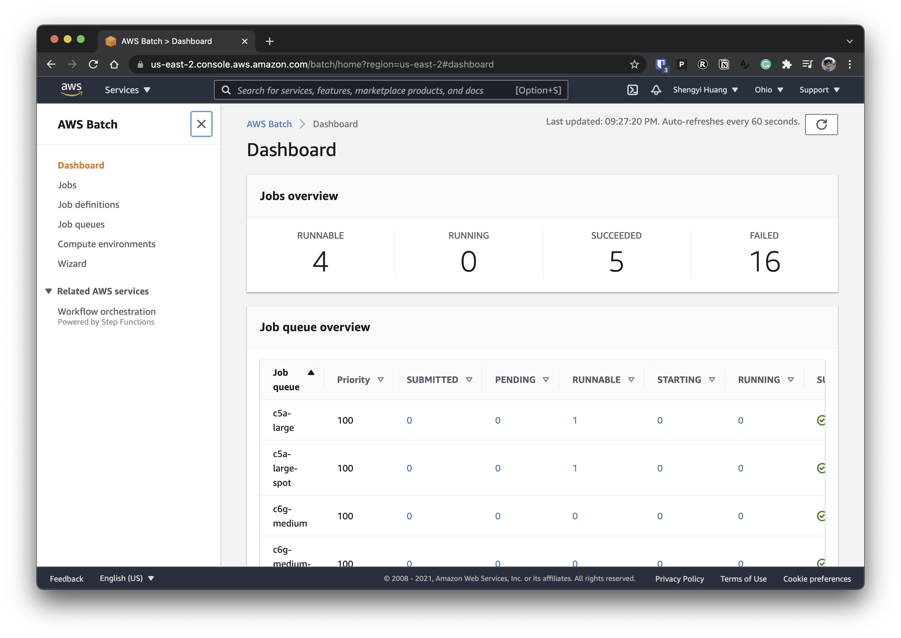

# Installation

The rough idea behind the cloud integration is to package our code into a docker container and use AWS Batch to
run thousands of experiments concurrently. 

## Prerequisites

* Terraform (see installation tutorial [here](https://learn.hashicorp.com/tutorials/terraform/install-cli))

We use Terraform to define our infrastructure with AWS Batch, which you can spin up as follows

```bash
# assuming you are at the root of the CleanRL project
poetry install -E cloud
cd cloud
python -m awscli configure
terraform init
export AWS_DEFAULT_REGION=$(aws configure get region --profile default)
terraform apply
```

<script id="asciicast-445048" src="https://asciinema.org/a/445048.js" async></script>

!!! note
    Don't worry about the cost of spining up these AWS Batch compute environments and job queues. They are completely free and you are only charged when you submit experiments.


Then your AWS Batch console should look like




### Clean Up
Uninstalling/Deleting the infrastructure is pretty straightforward:
```
export AWS_DEFAULT_REGION=$(aws configure get region --profile default)
terraform destroy
```
