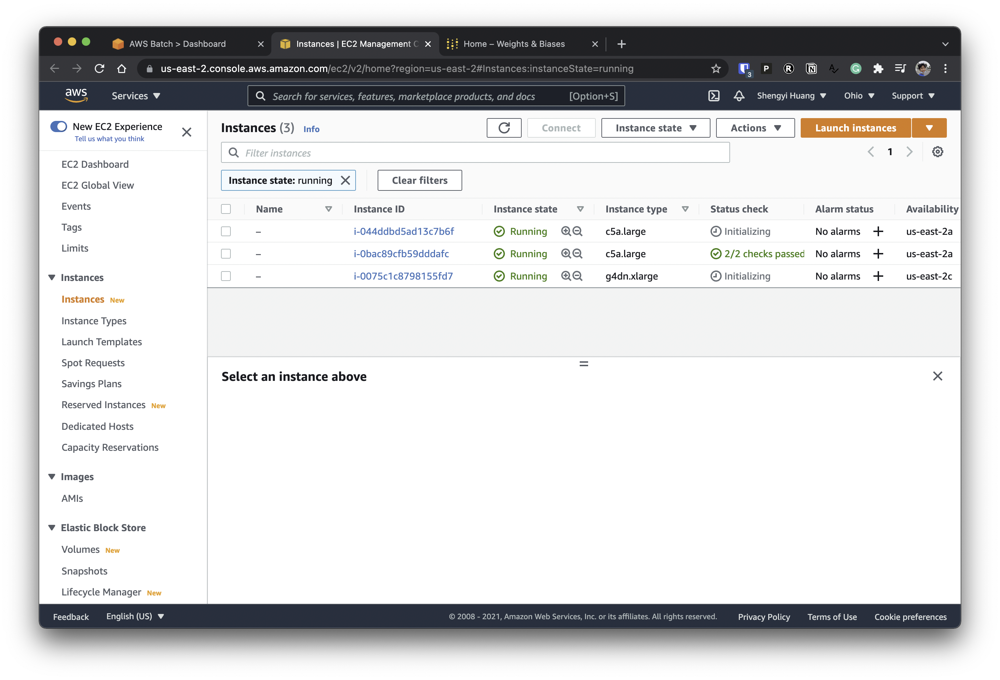
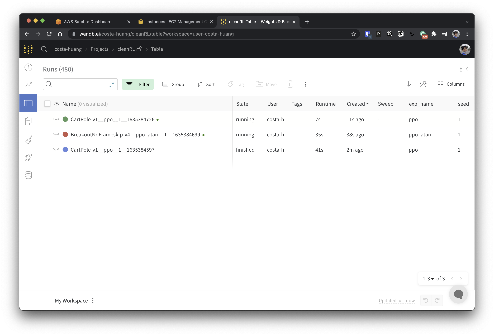

# Submit Experiments

### Inspection

Dry run to inspect the generated docker command
```
poetry run python -m cleanrl_utils.submit_exp \
    --docker-tag vwxyzjn/cleanrl:latest \
    --command "poetry run python cleanrl/ppo.py --env-id CartPole-v1 --total-timesteps 100000 --track --capture_video" \
    --num-seed 1
```

The generated docker command should look like
```
docker run -d --cpuset-cpus="0" -e WANDB_API_KEY=xxxxxxxxxxxxxxxxxxxxxxxxxxxxxxxxxxxxxxxxx vwxyzjn/cleanrl:latest /bin/bash -c "poetry run python cleanrl/ppo.py --env-id CartPole-v1 --total-timesteps 100000 --track --capture_video --seed 1"
```

### Run on AWS

Submit a job using AWS's compute-optimized spot instances 
```
poetry run python -m cleanrl_utils.submit_exp \
    --docker-tag vwxyzjn/cleanrl:latest \
    --command "poetry run python cleanrl/ppo.py --env-id CartPole-v1 --total-timesteps 100000 --track --capture_video" \
    --job-queue c5a-large-spot \
    --num-seed 1 \
    --num-vcpu 1 \
    --num-memory 2000 \
    --num-hours 48.0 \
    --provider aws
```

Submit a job using AWS's accelerated-computing spot instances 
```
poetry run python -m cleanrl_utils.submit_exp \
    --docker-tag vwxyzjn/cleanrl:latest \
    --command "poetry run python cleanrl/ppo_atari.py --env-id BreakoutNoFrameskip-v4 --track --capture_video" \
    --job-queue g4dn-xlarge-spot \
    --num-seed 1 \
    --num-vcpu 1 \
    --num-gpu 1 \
    --num-memory 4000 \
    --num-hours 48.0 \
    --provider aws
```

Submit a job using AWS's compute-optimized on-demand instances 
```
poetry run python -m cleanrl_utils.submit_exp \
    --docker-tag vwxyzjn/cleanrl:latest \
    --command "poetry run python cleanrl/ppo.py --env-id CartPole-v1 --total-timesteps 100000 --track --capture_video" \
    --job-queue c5a-large \
    --num-seed 1 \
    --num-vcpu 1 \
    --num-memory 2000 \
    --num-hours 48.0 \
    --provider aws
```

Submit a job using AWS's accelerated-computing on-demand instances 
```
poetry run python -m cleanrl_utils.submit_exp \
    --docker-tag vwxyzjn/cleanrl:latest \
    --command "poetry run python cleanrl/ppo_atari.py --env-id BreakoutNoFrameskip-v4 --track --capture_video" \
    --job-queue g4dn-xlarge \
    --num-seed 1 \
    --num-vcpu 1 \
    --num-gpu 1 \
    --num-memory 4000 \
    --num-hours 48.0 \
    --provider aws
```

<script id="asciicast-445050" src="https://asciinema.org/a/445050.js" async></script>

Then you should see:






## Customize the Docker Container

Set up docker's `buildx` and login in to your preferred registry.

```
docker buildx create --use
docker login
```

Then you could build a container using the `--build` flag based on the `Dockerfile` in the current directory. Also, `--push` will auto-push to the docker registry.

```
poetry run python -m cleanrl_utils.submit_exp \
    --docker-tag vwxyzjn/cleanrl:latest \
    --command "poetry run python cleanrl/ppo.py --env-id CartPole-v1 --total-timesteps 100000 --track --capture_video" \
    --build --push
```

To build a multi-arch image using `--archs linux/arm64,linux/amd64`:

```
poetry run python -m cleanrl_utils.submit_exp \
    --docker-tag vwxyzjn/cleanrl:latest \
    --command "poetry run python cleanrl/ppo.py --env-id CartPole-v1 --total-timesteps 100000 --track --capture_video" \
    --archs linux/arm64,linux/amd64
    --build --push
```

!!! note
    Building an multi-arch image is quite slow but will allow you to use ARM instances such as `m6gd.medium` that is 20-70% cheaper than X86 instances.
    However, note there is no cloud providers that give ARM instances with Nvidia's GPU (to my knowledge), so this effort might not be worth it.

    If you still wants to pursue multi-arch, you can speed things up by using a native ARM server and connect it to your `buildx` instance:

    ```
    docker -H ssh://costa@gpu info
    docker buildx create --name remote --use
    docker buildx create --name remote --append ssh://costa@gpu
    docker buildx inspect --bootstrap
    python -m cleanrl_utils.submit_exp -b --archs linux/arm64,linux/amd64
    ```
