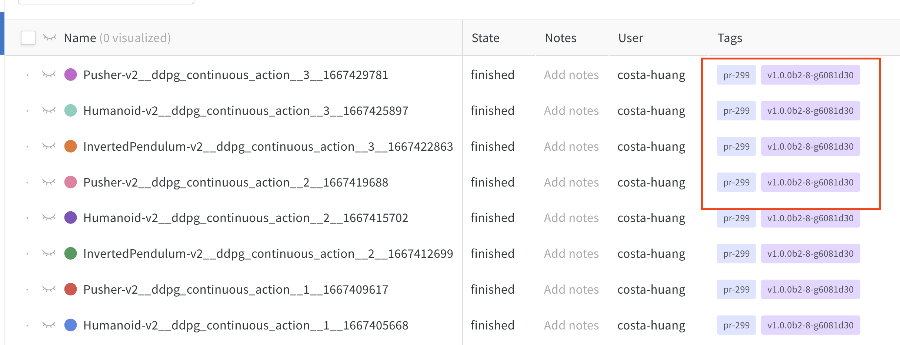
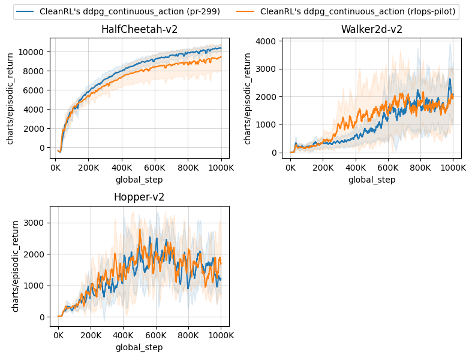

👍🎉 Thank you for taking the time to contribute! 🎉👍

Feel free to open an issue or a Pull Request if you have any questions or suggestions. You can also [join our Discord](https://discord.gg/D6RCjA6sVT) and ask questions there. If you plan to work on an issue, let us know in the issue thread to avoid duplicate work.

Good luck and have fun!

## Development Environment Setup

To setup the development environment, please clone the repository and follow the [installation docs](/get-started/installation/) and [usage docs](/get-started/basic-usage). They should help you set a working poetry environment, so you have the same set up as other contributors. Additionally, you may want to run the following command to install dev-dependencies for documentation:

```bash
poetry install -E docs
```


To build the documentation, you can run the following command:

```bash
poetry run mkdocs serve
```

For testing, we generally recommend making a PR and let GitHub run the tests in [`.github/workflows/tests.yaml`](https://github.com/vwxyzjn/cleanrl/blob/master/.github/workflows/tests.yaml) automatically. These tests are cross-platform and run on Linux, macOS, and Windows. However, if you want to run the tests locally, you can run the following command:

```bash
poetry run install --all-extras
poetry run pytest tests/.
```


Also, we use [pre-commit](https://pre-commit.com/) to helps us automate a sequence of short tasks (called pre-commit "hooks") such as code formatting. In particular, we always use the following hooks when submitting code to the main repository.

* [**pyupgrade**](https://github.com/asottile/pyupgrade): pyupgrade upgrades syntax for newer versions of the language. 
* [**isort**](https://github.com/PyCQA/isort): isort sorts imported dependencies according to their type (e.g, standard library vs third-party library) and name.
* [**black**](https://black.readthedocs.io/en/stable/): black enforces an uniform code style across the codebase.
* [**autoflake**](https://github.com/PyCQA/autoflake): autoflake helps remove unused imports and variables.
* [**codespell**](https://github.com/codespell-project/codespell): codespell helps avoid common incorrect spelling.

You can run the following command to run the following hooks:

```bash
poetry run pre-commit run --all-files
```

which in most cases should automatically fix things as shown below: 


## Contribution Process


!!! warning

    **Before opening a pull request**, please open an issue first to discuss with us since this is likely a sizable effort. Once we agree on the plan, feel free to make a PR to include the new algorithm.

To ensure the validity of new features or bug fixes and prevent regressions, we use the "RLops" process. Deep Reinforcement Learning (DRL) is brittle and suffers from various reproducibility issues. Even bug fixes can sometimes lead to performance regressions (e.g., see [how a bug fix of contact force in MuJoCo results in worse performance for PPO](https://github.com/openai/gym/pull/2762#discussion_r853488897)).


Therefore, it is essential to understand how the proposed changes impact the performance of the algorithms. Broadly, we categorize contributions into two types: 1) non-performance-impacting changes and 2) performance-impacting changes.

* **non-performance-impacting changes**: this type of change does *not* impact the performance of the algorithm, such as documentation fixes ([:material-github: #282](https://github.com/vwxyzjn/cleanrl/pull/282)), renaming variables ([:material-github: #257](https://github.com/vwxyzjn/cleanrl/pull/257)), and removing unused code ([:material-github: #287](https://github.com/vwxyzjn/cleanrl/pull/287)). For this type of change, we can easily merge them without worrying too much about the consequences.
* **performance-impacting changes**: this type of change influences the algorithm's performance. Examples include making a slight modification to the `gamma` parameter in PPO ([:material-github: #209](https://github.com/vwxyzjn/cleanrl/pull/209)), properly handling action bounds in DDPG ([:material-github: #211](https://github.com/vwxyzjn/cleanrl/pull/211)), and fixing bugs ([:material-github: #281](https://github.com/vwxyzjn/cleanrl/pull/281))


**Non-performance-impacting changes** are relatively straightforward — we just need to make sure the tests pass and the code is formatted correctly. However, **performance-impacting changes** are more complicated. We need to make sure that the proposed changes do not lead to performance regressions. To do so, we use the "RLops" process detailed below, which is a set of procedures to help us run experiments and understand the impacts of the proposed changes.


## RLops for Performance-impacting Changes:


Importantly, **regardless of the slight difference in performance-impacting changes, we need to re-run the benchmark to ensure there is no regression**. To do so, we are going to leverage the `openrlbenchmark.rlops` CLI utility. This utility is a command-line interface that helps us run experiments and compare the performance of different versions of the codebase.

### (Step 1) Run the benchmark

Given a new feature, we create a PR and then run the benchmark experiments through [`benchmark.py`](https://github.com/vwxyzjn/cleanrl/blob/master/cleanrl_utils/benchmark.py), such as the following:

```bash
poetry install -E "docs mujoco_py"
python -c "import mujoco_py"
xvfb-run -a python -m cleanrl_utils.benchmark \
    --env-ids HalfCheetah-v2 Walker2d-v2 Hopper-v2 \
    --command "poetry run python cleanrl/ddpg_continuous_action.py --track --capture_video" \
    --num-seeds 3 \
    --workers 1
```

under the hood, this script by default invokes an `--autotag` feature that tries to tag the the experiments with version control information, such as the git tag (e.g., `v1.0.0b2-8-g6081d30`) and the github PR number (e.g., `pr-299`). This is useful for us to compare the performance of the same algorithm across different versions.



### (Step 2) Regression check

Let's say our latest experiments is tagged with `pr-299`. We can then run the following command to compare its performance with our pilot experiments `rlops-pilot`. Note that the pilot experiments include all experiments before we started using RLops (i.e., `rlops-pilot` is the baseline).


```bash
python -m openrlbenchmark.rlops \
    --filters '?we=openrlbenchmark&wpn=cleanrl&ceik=env_id&cen=exp_name&metric=charts/episodic_return' \
        'ddpg_continuous_action?tag=pr-299' \
        'ddpg_continuous_action?tag=rlops-pilot' \
    --output-filename compare \
    --scan-history \
    --report
```

Here, we created a filter `'?we=openrlbenchmark&wpn=cleanrl&ceik=env_id&cen=exp_name&metric=charts/episodic_return'`, which is a query string that specifies the following:

* `we`: the W&B entity name
* `wpn`: the W&B project name
* `ceik`: the custom key for the environment id
* `cen`: the custom key for the experiment name
* `metric`: the metric we are interested in

So we are fetching metrics from [https://wandb.ai/openrlbenchmark/cleanrl](https://wandb.ai/openrlbenchmark/cleanrl). The environment id is stored in the `env` key, and the experiment name is stored in the `exp_name` key. The metric we are interested in is `charts/episodic_return`.


<script async id="asciicast-570481" src="https://asciinema.org/a/570481.js"></script>


It generates a table comparing the runtime (in minutes):

|                |   openrlbenchmark/cleanrl/ddpg_continuous_action ({'tag': ['pr-299']}) |   openrlbenchmark/cleanrl/ddpg_continuous_action ({'tag': ['rlops-pilot']}) |
|:---------------|-----------------------------------------------------------------------:|----------------------------------------------------------------------------:|
| Hopper-v2      |                                                                49.596  |                                                                     64.7033 |
| Walker2d-v2    |                                                                50.1181 |                                                                     64.8198 |
| HalfCheetah-v2 |                                                                50.97   |                                                                     65.8884 |

It also generates a table comparing the episodic return in the last 100 episodes:

|                | openrlbenchmark/cleanrl/ddpg_continuous_action ({'tag': ['pr-299']})   | openrlbenchmark/cleanrl/ddpg_continuous_action ({'tag': ['rlops-pilot']})   |
|:---------------|:-----------------------------------------------------------------------|:----------------------------------------------------------------------------|
| Hopper-v2      | 1007.44 ± 148.29                                                       | 1126.37 ± 278.02                                                            |
| Walker2d-v2    | 1661.14 ± 250.01                                                       | 1447.09 ± 260.24                                                            |
| HalfCheetah-v2 | 10210.57 ± 196.22                                                      | 9205.65 ± 1093.88                                                           |


!!! info

    For more documentation on `openrlbenchmark.rlops`, please refer to its [documentation](https://github.com/openrlbenchmark/openrlbenchmark). 

!!! tip

    To make the script run faster, we can choose not to use `--scan-history` which allows wandb to sample 500 data points from the training data. This is the default behavior and is much faster.


It also generates the following image and a wandb report.



<iframe loading="lazy" src="https://wandb.ai/openrlbenchmark/cleanrl-cache/reports/Regression-Report-ddpg_continuous_action-pr-299-rlops-pilot---VmlldzoyODkyNTcy" style="width:100%; height:500px" title="Regression Report: ddpg_continuous_action (['pr-299', 'rlops-pilot'])"></iframe>


### (Step 3) Update the documentation

Once we confirm there is no regression in the performance, we can update the documentation to display the new benchmark results. Run the previous command without comparing previous tags:

```bash
python -m cleanrl_utils.rlops --exp-name ddpg_continuous_action \
    --wandb-project-name cleanrl \
    --wandb-entity openrlbenchmark \
    --tags 'pr-299' \
    --env-ids HalfCheetah-v2 Walker2d-v2 Hopper-v2 \
    --output-filename compare.png \
    --scan-history \
    --metric-last-n-average-window 100
```

which gives us a table like below and a `compare.png` as the learning curve.

```
               CleanRL's ddpg_continuous_action (pr-299)
HalfCheetah-v2                         10210.57 ± 196.22
Walker2d-v2                             1661.14 ± 250.01
Hopper-v2                               1007.44 ± 148.29
```

We will use them to update the [experimental result section](https://github.com/vwxyzjn/cleanrl/blob/master/docs/rl-algorithms/ddpg.md#experiment-results) in the docs and replace the learning curves with the new ones. 


### (Step 4) Update test cases

In CleanRL, we have end-to-end test cases that at least ensure the code can run without crashing. When applicable, you should update the test cases in `tests` and CI setting at [`.github/workflows/tests.yaml`](https://github.com/vwxyzjn/cleanrl/blob/master/.github/workflows/tests.yaml).


### (Step 5) Merge the PR

Finally, we can merge the PR.


## Checklist

Here is a checklist of the contribution process. See [:material-github: #331](https://github.com/vwxyzjn/cleanrl/pull/331/files) as an example for the list of deliverables.

- [ ] I've read the [CONTRIBUTION](https://docs.cleanrl.dev/contribution/) guide (**required**).
- [ ] I have ensured `pre-commit run --all-files` passes (**required**).
- [ ] I have updated the tests accordingly (if applicable).
- [ ] I have updated the documentation and previewed the changes via `mkdocs serve`.
    - [ ] I have explained note-worthy implementation details.
    - [ ] I have explained the logged metrics.
    - [ ] I have added links to the original paper and related papers.


If you need to run benchmark experiments for a performance-impacting changes:

- [ ] I have contacted @vwxyzjn to obtain access to the [openrlbenchmark W&B team](https://wandb.ai/openrlbenchmark).
- [ ] I have used the [benchmark utility](/get-started/benchmark-utility/) to submit the tracked experiments to the [openrlbenchmark/cleanrl](https://wandb.ai/openrlbenchmark/cleanrl) W&B project, optionally with `--capture_video`.
- [ ] I have performed RLops with `python -m openrlbenchmark.rlops`.
    - For new feature or bug fix:
        - [ ] I have used the RLops utility to understand the performance impact of the changes and confirmed there is no regression.
    - For new algorithm:
        - [ ] I have created a table comparing my results against those from reputable sources (i.e., the original paper or other reference implementation).
    - [ ] I have added the learning curves generated by the `python -m openrlbenchmark.rlops` utility to the documentation.
    - [ ] I have added links to the tracked experiments in W&B, generated by `python -m openrlbenchmark.rlops ....your_args... --report`,  to the documentation.

