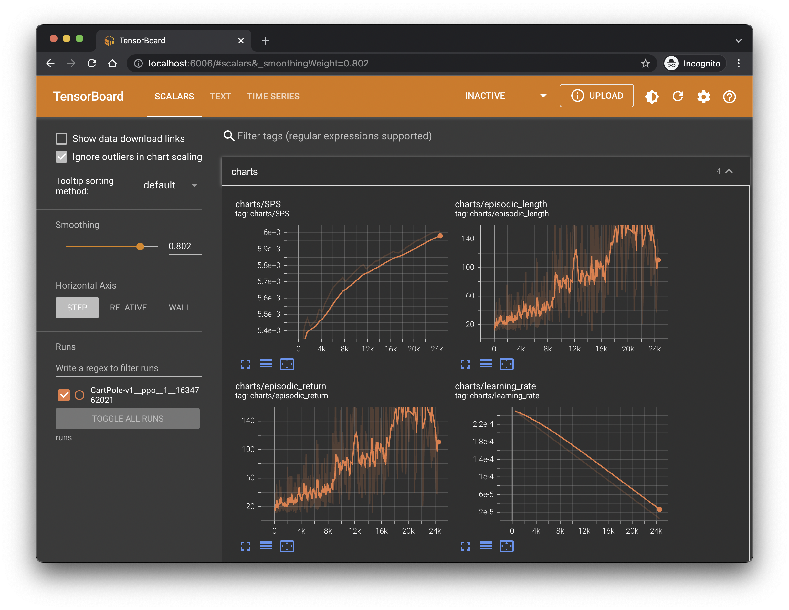
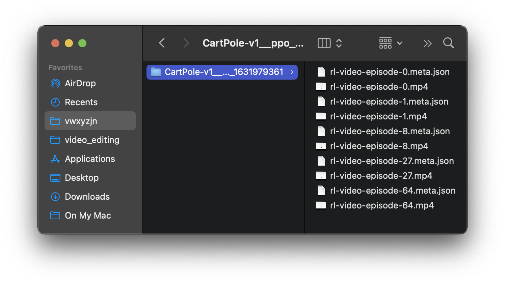
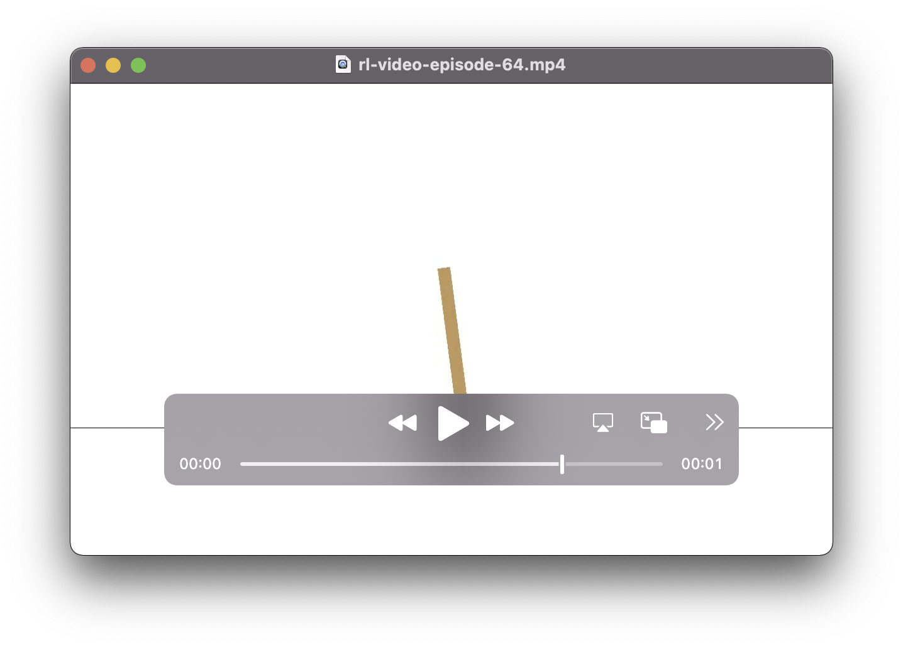

# Basic Usage

## Two Ways to Run
After the dependencies have been installed, there are **two ways** to run 
the CleanRL script under the poetry virtual environments.


1. Using `poetry run`:

    ```bash
    poetry run python cleanrl/ppo.py \
        --seed 1 \
        --gym-id CartPole-v0 \
        --total-timesteps 50000
    ```
    <script id="asciicast-443649" src="https://asciinema.org/a/443649.js" async></script>


2. Using `poetry shell`:

    1. We first activate the virtual environment by using
    `poetry shell`
    2. Then, run any desired CleanRL script
   
    Attention: Each step must be executed separately!


    ```bash
    poetry shell
    ```
    ```bash
    python cleanrl/ppo.py \
        --seed 1 \
        --gym-id CartPole-v0 \
        --total-timesteps 50000
    ```
    <script id="asciicast-JL1FR00I2JNklAhMd2dwEAQuz" src="https://asciinema.org/a/JL1FR00I2JNklAhMd2dwEAQuz.js" async></script>

!!! note

    We recommend `poetry shell` workflow for development. When the shell is activeated, you should
    be seeing a prefix like `(cleanrl-iXg02GqF-py3.9)` in your shell's prompt, which is the name
    of the poetry's virtual environment.
    **We will assume to run other commands (e.g. `tensorboard`) in the documentation within the poetry's shell.**


## Visualize Training Metrics

By default, the CleanRL scripts record all the training metrics via Tensorboard
into the `runs` folder. So, after running the training script above, feel free to run

```bash
tensorboard --logdir runs
```




## Visualize the Agent's Gameplay Videos

CleanRL helps record the agent's gameplay videos with a `--capture-video` flag,
which will save the videos in the `videos/{$run_name}` folder.

```bash linenums="1" hl_lines="5"
python cleanrl/ppo.py \
    --seed 1 \
    --gym-id CartPole-v0 \
    --total-timesteps 50000 \
    --capture-video
```




## Get Documentation

You can directly obtained the documentation by using the `--help` flag.

```bash
python cleanrl/ppo.py --help

usage: ppo.py [-h] [--exp-name EXP_NAME] [--gym-id GYM_ID]
              [--learning-rate LEARNING_RATE] [--seed SEED]
              [--total-timesteps TOTAL_TIMESTEPS]
              [--torch-deterministic [TORCH_DETERMINISTIC]] [--cuda [CUDA]]
              [--track [TRACK]] [--wandb-project-name WANDB_PROJECT_NAME]
              [--wandb-entity WANDB_ENTITY] [--capture-video [CAPTURE_VIDEO]]
              [--num-envs NUM_ENVS] [--num-steps NUM_STEPS]
              [--anneal-lr [ANNEAL_LR]] [--gae [GAE]] [--gamma GAMMA]
              [--gae-lambda GAE_LAMBDA] [--num-minibatches NUM_MINIBATCHES]
              [--update-epochs UPDATE_EPOCHS] [--norm-adv [NORM_ADV]]
              [--clip-coef CLIP_COEF] [--clip-vloss [CLIP_VLOSS]]
              [--ent-coef ENT_COEF] [--vf-coef VF_COEF]
              [--max-grad-norm MAX_GRAD_NORM] [--target-kl TARGET_KL]

optional arguments:
  -h, --help            show this help message and exit
  --exp-name EXP_NAME   the name of this experiment
  --gym-id GYM_ID       the id of the gym environment
  --learning-rate LEARNING_RATE
                        the learning rate of the optimizer
  --seed SEED           seed of the experiment
  --total-timesteps TOTAL_TIMESTEPS
                        total timesteps of the experiments
  --torch-deterministic [TORCH_DETERMINISTIC]
                        if toggled, `torch.backends.cudnn.deterministic=False`
  --cuda [CUDA]         if toggled, cuda will be enabled by default
  --track [TRACK]       if toggled, this experiment will be tracked with Weights
                        and Biases
  --wandb-project-name WANDB_PROJECT_NAME
                        the wandb's project name
  --wandb-entity WANDB_ENTITY
                        the entity (team) of wandb's project
  --capture-video [CAPTURE_VIDEO]
                        weather to capture videos of the agent performances (check
                        out `videos` folder)
  --num-envs NUM_ENVS   the number of parallel game environments
  --num-steps NUM_STEPS
                        the number of steps to run in each environment per policy
                        rollout
  --anneal-lr [ANNEAL_LR]
                        Toggle learning rate annealing for policy and value
                        networks
  --gae [GAE]           Use GAE for advantage computation
  --gamma GAMMA         the discount factor gamma
  --gae-lambda GAE_LAMBDA
                        the lambda for the general advantage estimation
  --num-minibatches NUM_MINIBATCHES
                        the number of mini-batches
  --update-epochs UPDATE_EPOCHS
                        the K epochs to update the policy
  --norm-adv [NORM_ADV]
                        Toggles advantages normalization
  --clip-coef CLIP_COEF
                        the surrogate clipping coefficient
  --clip-vloss [CLIP_VLOSS]
                        Toggles wheter or not to use a clipped loss for the value
                        function, as per the paper.
  --ent-coef ENT_COEF   coefficient of the entropy
  --vf-coef VF_COEF     coefficient of the value function
  --max-grad-norm MAX_GRAD_NORM
                        the maximum norm for the gradient clipping
  --target-kl TARGET_KL
                        the target KL divergence threshold
```
