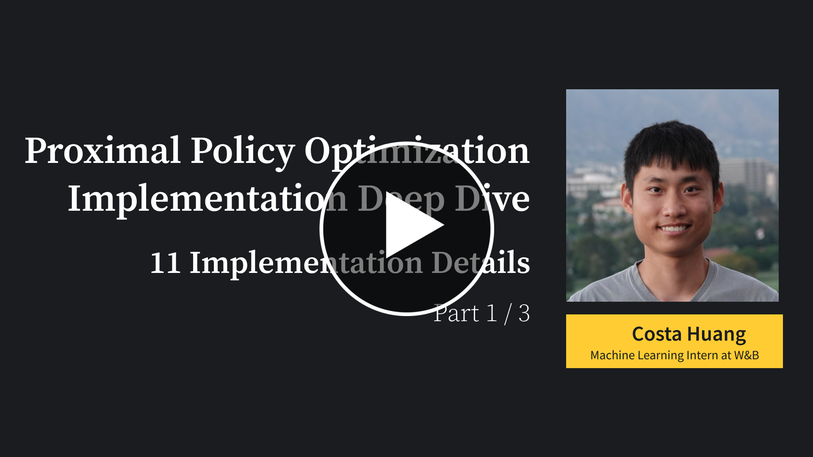
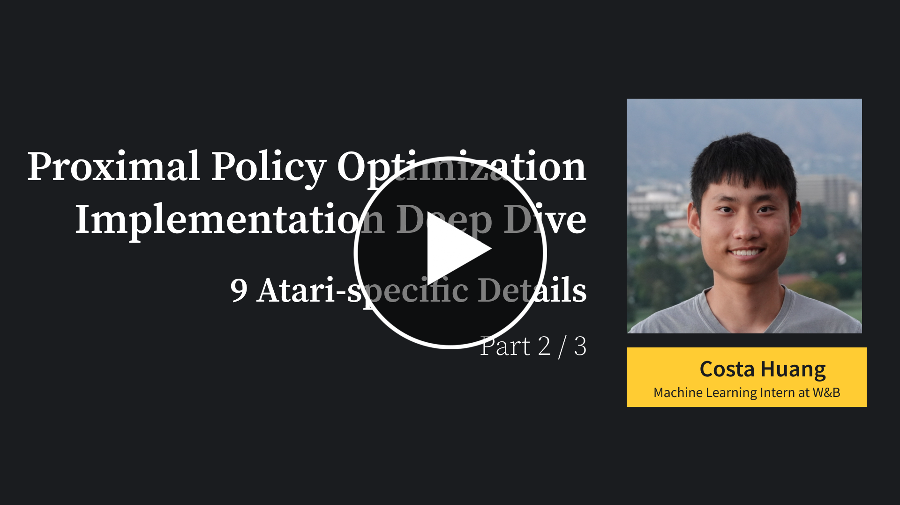
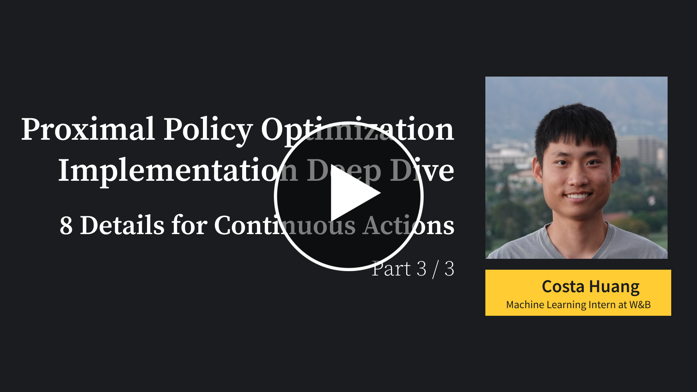

# Proximal Policy Gradient (PPO) 

PPO is one of the most popular DRL algorithms. It runs reasonably fast by leveraging vector (parallel) environments, and naturally works well with different action spaces, therefore supporting a variety of games. It also has good sample efficiency compared to algorithms such as DQN.

Original paper: 

* [Proximal Policy Optimization Algorithms](https://arxiv.org/abs/1707.06347)

Reference resources:

* [Implementation Matters in Deep Policy Gradients: A Case Study on PPO and TRPO](https://arxiv.org/abs/2005.12729)
* [What Matters In On-Policy Reinforcement Learning? A Large-Scale Empirical Study](https://arxiv.org/abs/2006.05990)

All our PPO implementations below are augmented with the same code-level optimizations presented in `openai/baselines`'s [PPO](https://github.com/openai/baselines/tree/master/baselines/ppo2). See [The 32 Implementation Details of Proximal Policy Optimization (PPO) Algorithm](https://costa.sh/blog-the-32-implementation-details-of-ppo.html) for more details.

Our single-file implementations of PPO:

* [ppo.py](https://github.com/vwxyzjn/cleanrl/blob/master/cleanrl/ppo.py)
    * Works with the `Box` observation space of low-level features
    * Works with the `Discerete` action space
    * Works with envs like `CartPole-v1`
    * Includes the 11 core implementation details as shown in the following video tutorial
      
* [ppo_atari.py](https://github.com/vwxyzjn/cleanrl/blob/master/cleanrl/ppo_atari.py)
    * For playing Atari games. It uses convolutional layers and common atari-based pre-processing techniques.
    * Works with the Atari's pixel `Box` observation space of shape `(210, 160, 3)`
    * Works with the `Discerete` action space
    * Includes the 9 Atari-specific implementation details as shown in the following video tutorial
      
* [ppo_continuous_action.py](https://github.com/vwxyzjn/cleanrl/blob/master/cleanrl/ppo_continuous_action.py)
    * For continuous action space. Also implemented Mujoco-specific code-level optimizations
    * Works with the `Box` observation space of low-level features
    * Works with the `Box` (continuous) action space
    * Includes the 8 implementation details for  as shown in the following video tutorial (need fixing)
      
